# Software Engineering Methods - Group 4

- Master Build Status 
- License 
- Releases 
- Master Code Coverage 

## Group Members:
1. Esaias Burnette              GMT-4
2. Alan Rodney Gooding          GMT-4
3. Mouli Madhuryu Gundu         GMT+1
4. Elizabeth Sibongile Khosa    GMT-4
5. Jesher Olivarez              GMT-4
6. Martin Sheen                 GMT-4

## Project Sprint board/Kanban Board 
https://zube.io/martinsvg/sem-group-4/w/project-workspace/kanban

## Requirements Met Tracker

| ID    | Name | Met  | Screenshot |
|-------|------|------|------------|
| 1     | All the countries in the world organised by largest population to smallest. | Yes |  |
| 2     | All the countries in a continent organised by largest population to smallest. | Yes |   |
| 3     | All the countries in a region organised by largest population to smallest. | Yes |  |
| 4     | The top N populated countries in the world where N is provided by the user.| Yes | 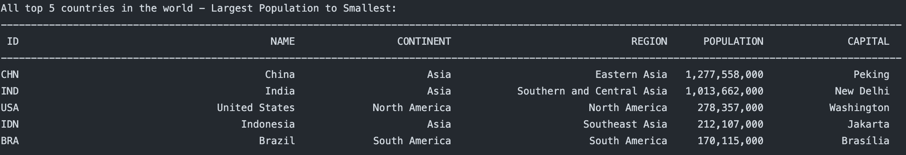 |
| 5     | The top N populated countries in a continent where N is provided by the user.| Yes | 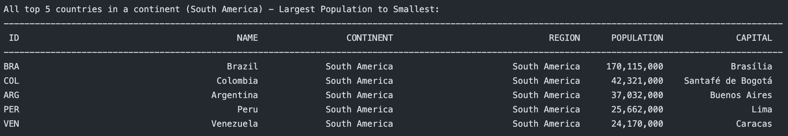 |
| 6     | The top N populated countries in a region where N is provided by the user. | Yes | 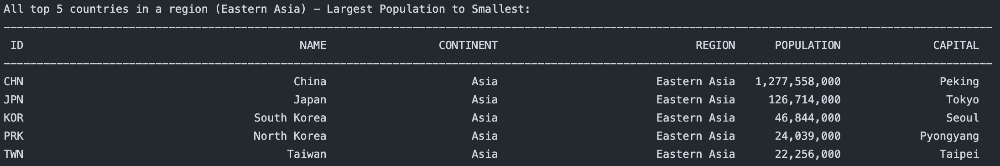 |
| 7     | All the cities in the world organised by largest population to smallest. | Yes | |
| 8     | All the cities in a continent organised by largest population to smallest. | Yes | 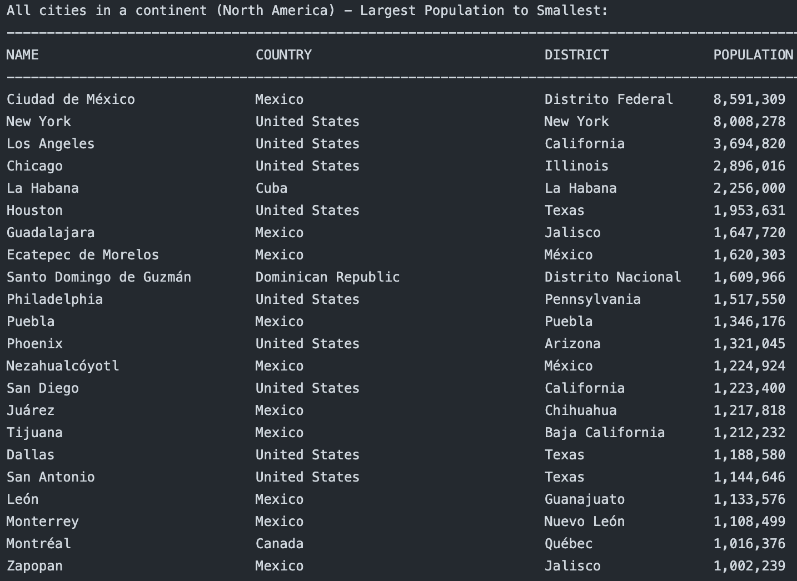 |
| 9     | All the cities in a region organised by largest population to smallest. | Yes | 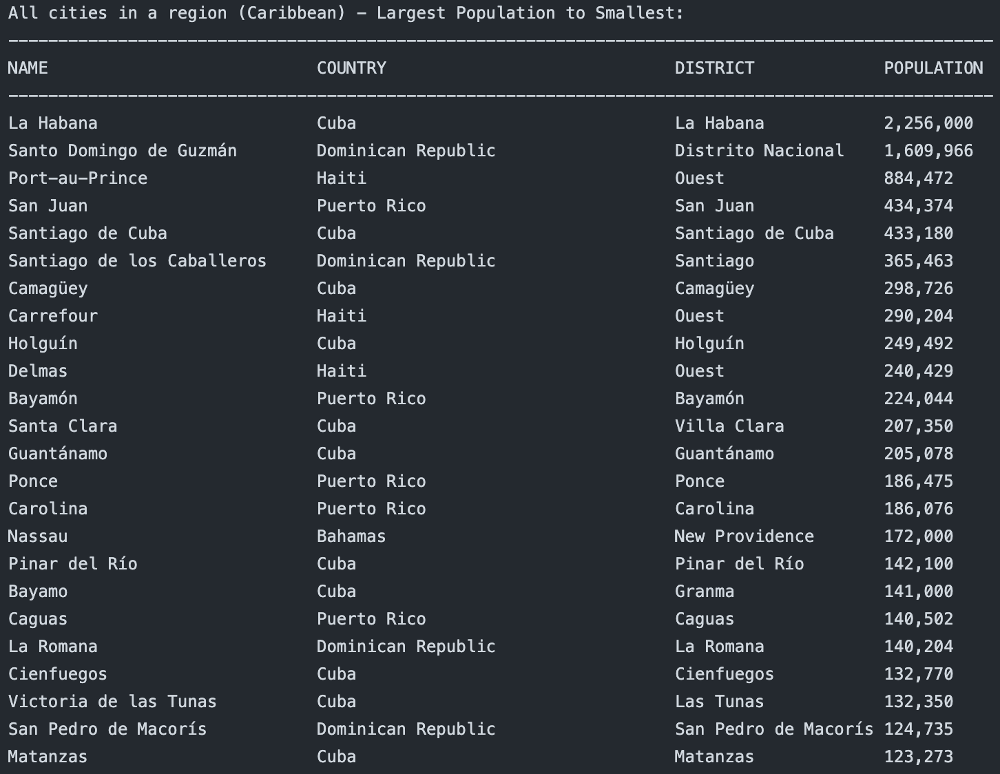|
| 10    | All the cities in a country organised by largest population to smallest. | Yes | 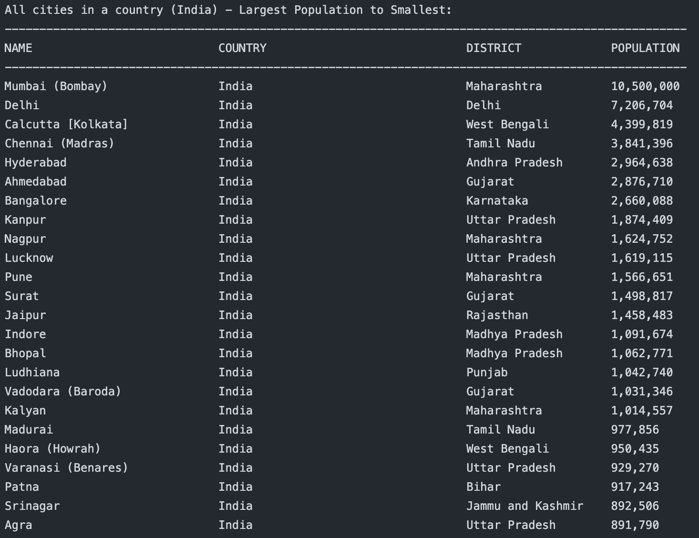|
| 11    | All the cities in a district organised by largest population to smallest. | Yes |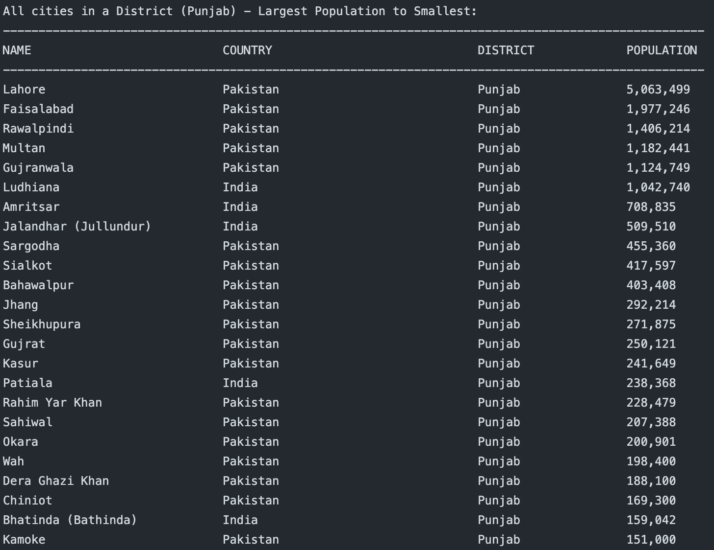|
| 12    | The top N populated cities in the world where N is provided by the user. | Yes | 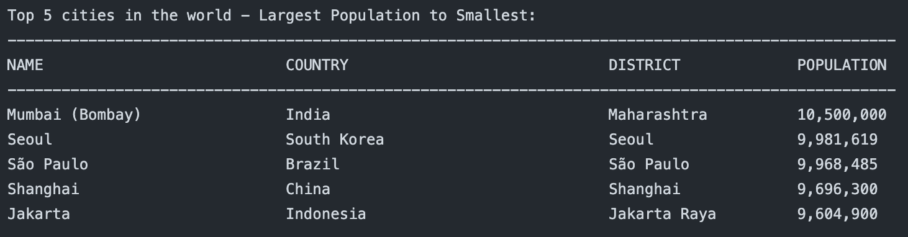|
| 13    | The top N populated cities in a continent where N is provided by the user. | Yes | 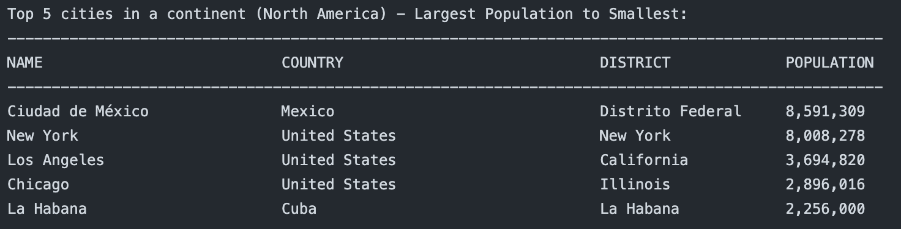|
| 14    | The top N populated cities in a region where N is provided by the user. | Yes |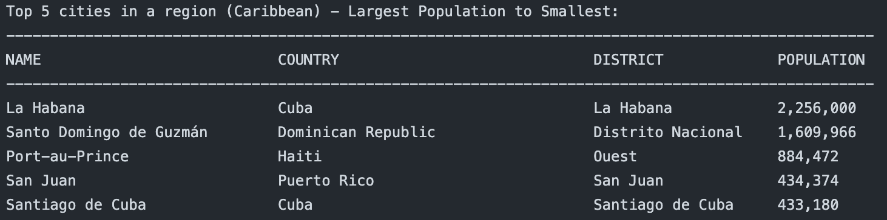|
| 15    | The top N populated cities in a country where N is provided by the user. | Yes | |
| 16    | The top N populated cities in a district where N is provided by the user. | Yes | 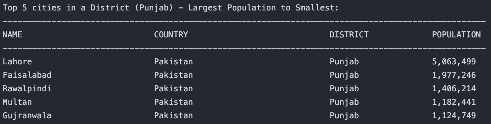|
| 17    | All the capital cities in the world organised by largest population to smallest. | Yes | 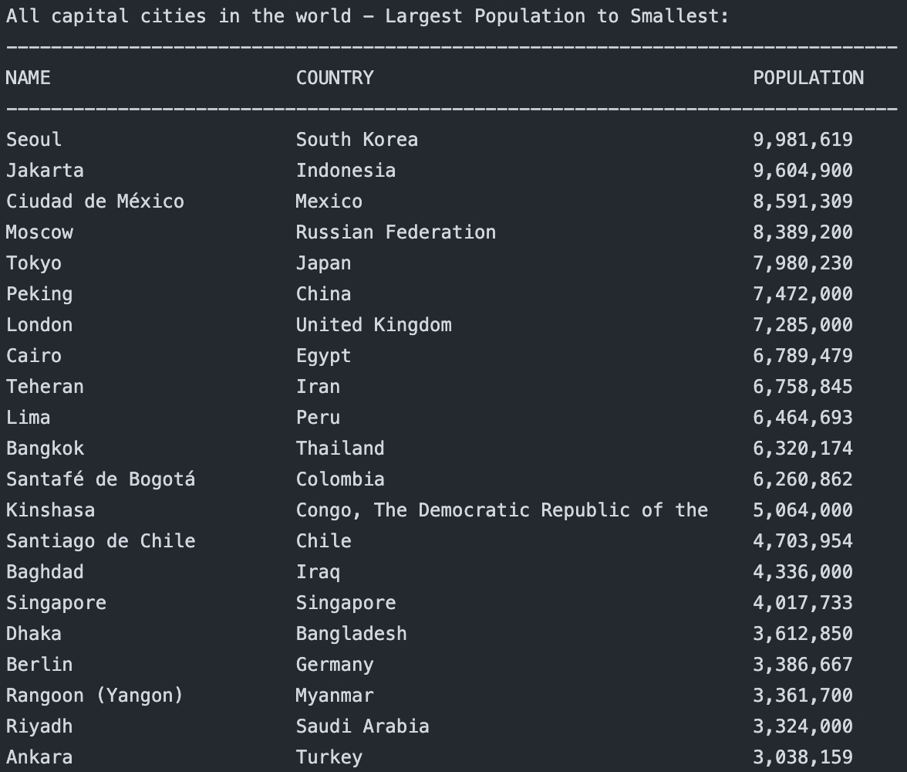|
| 18    | All the capital cities in a continent organised by largest population to smallest. | Yes | 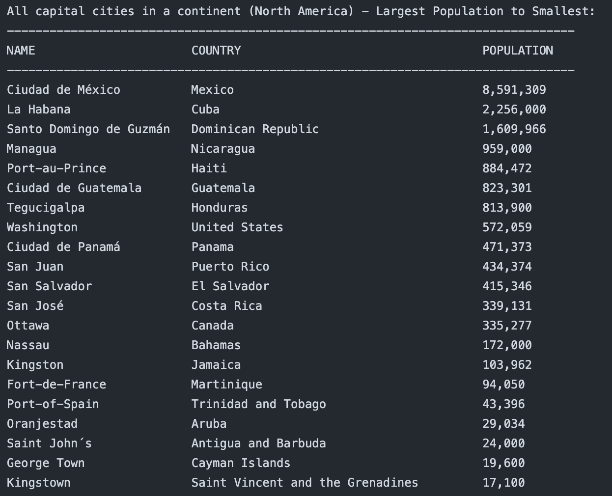|
| 19    | All the capital cities in a region organised by largest to smallest. | Yes | 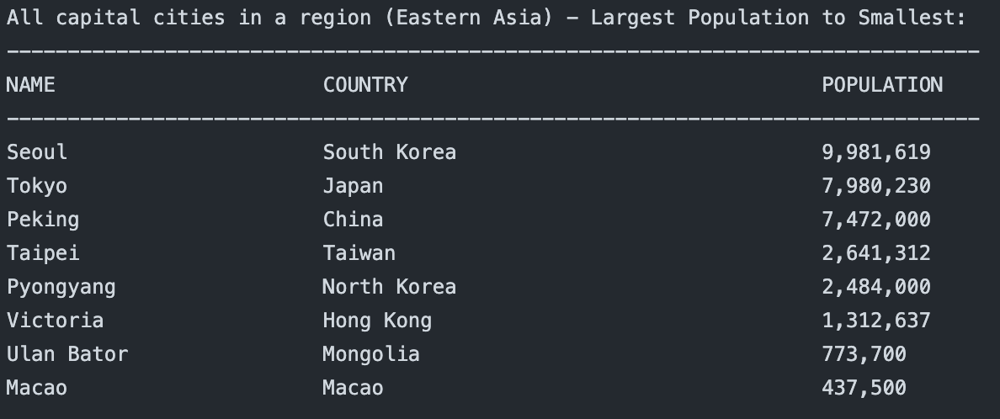|
| 20    | The top N populated capital cities in the world where N is provided by the user. | Yes | |
| 21    | The top N populated capital cities in a continent where N is provided by the user. | Yes | 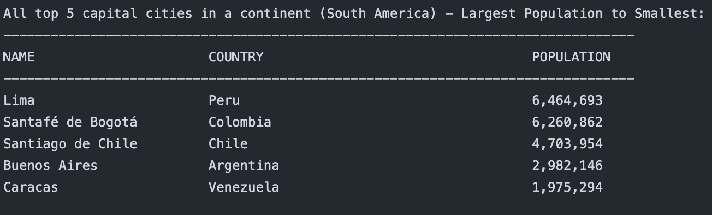|
| 22    | The top N populated capital cities in a region where N is provided by the user. | Yes | 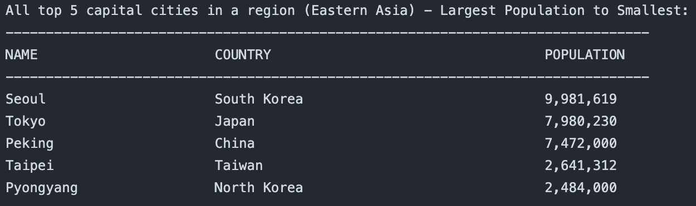 |
| 23    | The population of people, people living in cities, and people not living in cities in each continent. | Yes| 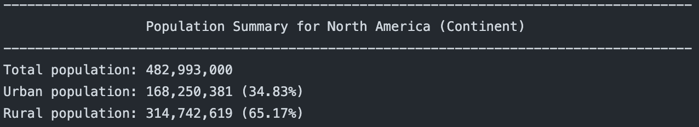 |
| 24    | The population of people, people living in cities, and people not living in cities in each region. | Yes |  |
| 25    | The population of people, people living in cities, and people not living in cities in each country. | Yes | 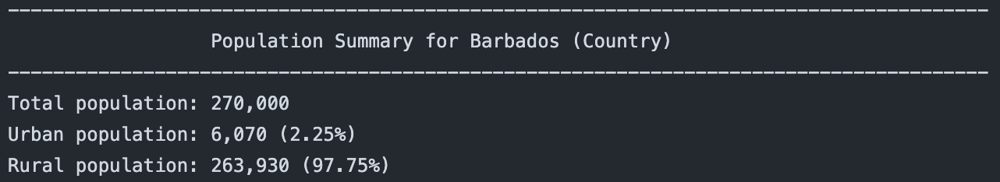 |
| 26    | The population of the world. | Yes | 
| 27    | The population of a continent. | Yes | 
| 28    | The population of a region. | Yes | 
| 29    | The population of a country. | Yes | 
| 30    | The population of a district. | Yes | 
| 31    | The population of a city. | Yes | 
| 32    | The number of people who speak the following the following languages from greatest number to smallest, including the percentage of the world population: Chinese, English, Hindi, Spanish, Arabic. | Yes | 

